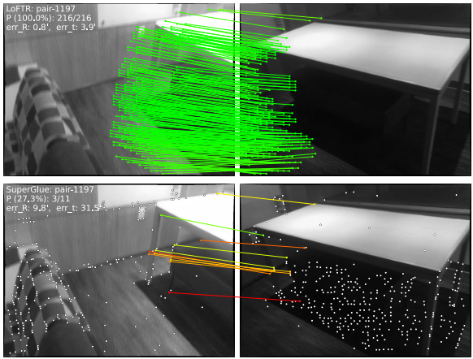

# LoFTR: Detector-Free Local Feature Matching with Transformers

## Abstract 
Traditional method: feature detection -> feature description -> feature matching -> warping and blending

New method: LoFTR -> RANSAC -> warping and blending

LoFTR: First establish pixel-wise dense matches at a coarse level and later refine the good matches at a fine level.

## Introduction

A feature detector may fail to extract enough interest points that are repetable between images dues to various factors such as **poor texture**, **repetitive patterns**, **viewpoint change**... 

Without repeatable interest points, it is impossible to find correct correspondences even with perfect descriptors.
 

CNN method:
- limited receptive field: can't recognize indistinctive regions

LoFTR(Local Feature TRansformer): 
- detector-free
- self and cross attention

## Method
1. **Local feature extraction**

Use a standard convolutional architectur to extract multi-level features from both images(1/2, 1/8)

2. **Local Feature Transformer Module**

LoFTR module transforms the features into feature representations that are easy to match.

3. **Establishing Coarse-level Matches

Two types matching layers OT, or dual-softmax

4. **Coarse-to-Fine Module**

After extablishing coarse matches, these matches are refined to the original image.

For every coarse match we first locate its position, and then crop two sets of local windows.
