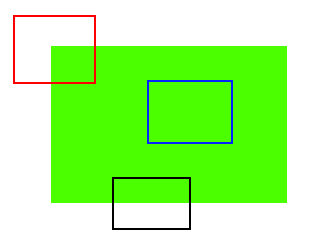
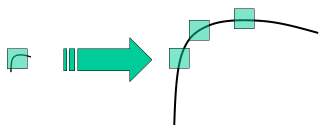
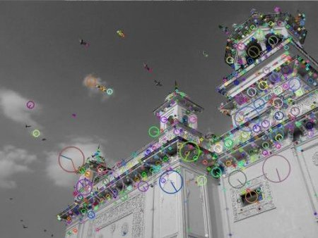
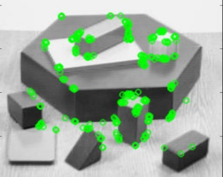

# Image stitching

- Feature Extraction
- Feature matching
- Image Registration/ Homography
- Warping & Blending

## Chapter 1.Traditional way recap
[opencv documentation](https://docs.opencv.org/4.x/db/d27/tutorial_py_table_of_contents_feature2d.html)

### 1-1 Understanding Features
How do computer stitch images? -> think of jigsaw puzzle

**We look for specific patterns or features** 

What are these features?

For red patch, it is a corner. Wherever you move the patch, it looks different.

**Corners are good features**

- **Feature Detection**: finding these image features
- **Feature Description**: computer describe the region aroung the features so that it can find it in other images.

### 1-2 Harris Corner Detection
**What does it do?**      

Find corner.

**How does it work**: 

It bascially finds difference in intensity for a displacement of (u,v) in all directions.

**Result**:

### 1-3 Shi-Tomasi Corner Detector & Good Features to Track
**What does it do?**

Find corner.

**What is the difference between Shi-Tomasi & Harris?**

The scoring method is different. 

- Harris: computationally faster.
- Shi-Tomasi: More accurate for tracking.

### 1-4 SIFT (Scale-Invariant Feature Transform)

Paper: Distinctive Image Features from Scale-Invariant Keypoints

Opencv Documentation: 

corner detectors like Harris are **rotation-invariant**, however **not scale invariant**. (A corner may not be a corner if the image is scaled.)

Ther are four steps.

#### 1. Scale-space Extrema Detection
We need different windows to detect keypoint with different scale. For this, scale-space filtering is used. Laplacian of Gaussian is found for the image with various alpha valus. 

**high alpha detect large corner, low alpha detect small corner**

Finding the local maxima off(x,y,alpha) values means there is a potential keypoint.

However LoG is costly, **DoG** is used in SIFT

#### 2. Keypoint Localization
Once potential keypoints locations are found, we need to get more accurate results. -> Taylor series

DoG has higher response for edges, we need to remove them by useing their eigen value.  

#### 3. Orientation Assignment
To achieve invariance to image rotation. The gradient magnitude of neighborhood around the keypoint location is calculated. 36 bins covering 360 degrees. **The highest peak in the histogram is taken and any peak above 80% of it is also considered**

#### 4. Keypoint Descriptor 
16 * 16 neighborhood is taken and is diviede into 16 sub-blocks of 4 * 4 size. For each sub-blocek 8 bin orientation.

#### 5. Keypoint Matching
Keypoint between two images are matched by **identifying their nearest neighbors**. -> To prevent noise, a ratio of closest-distance to second-closest distance is taken. If it is greater than 0.8, they rejected.

**Result**:

### 1-5 SURF(Speeded-up Robust Features)

- a speed up version

SIFT uses DoG to approximate LoG, while SURF use Box Filter. 

**What makes it faster than SIFT?**
- box filter
- integral images

**Orientation**: SURF uses wavelet reponses in horizontal and vertical direction

**Feature description**: a 64 dim or 128 dim. A 20 * 20 neighbor is divided into 4 * 4. For each subregion calculate the wavelet responses.

**matching strategy**: use the sign of Laplacian. ++, -- can match.

### 1-6 FAST 

**What is its advandage?**

It can be used in real-time application.

**Workflow**

1. Select a pixel p in the image which is to be identified as an interest point or no. Let its intensity be Ip.
2. Select appropriate threshold value t.
3. Consider a circle of 16 picels around the pixel under test.

1. Now the pixel p is a corner if there exists a set of n contiguous pixels in the circle which are brighter than Ip + t, or all darker than Ip - t.
2. A high-speed test was proposed to exclude a large number of non-corners. This test examines only the four pixels at 1, 9, 5, 13. I

**Weaknesses**

1. It does not reject as many candidates for n < 12
2. The choice of pixels is not optimal because it efficiency depends on ordering of the questions and distribution of corner appearances.
3. Results of high-speed tests are thrown away. 
4. Multiple features are detected adjacent to one another.

For 1, 2, 3 are addressed with a ML approach. 4 is addressed by non-maximal suppression

### 1-7 BRIEF(Binary Robust Independent Elementary Features)

**BRIEF is a feature descriptor. Doesn't provide method to find features.**

- CenSure(feature detectors) + BRIEF(feature descriptor)

**Background**

SIFT uses 128-dim floating point numbers for descriptors. For resource-constraint applications we can use BRIEF.

**BRIEF provides a shortcut to find the binary istrings directly without finding descriptors.**

**Strategy**

For every keypoints we randomly select two neighbor and compare them. Then we store the result.

One important point is that BRIEF is a feature descriptor, it doesn't provide any method to find the features. So you will have to use any other feature detectors like SIFT, SURF. The paper recommends to use **CenSurE**

### 1-8 ORB(Oriented FAST and Rotated BRIEF)

- A good alternative to SIFT and SURF in computation cost, matching performance and patents.

ORB is a **fusion of FAST keypoint detector and BRIEF descriptor**.

**Orientation**

Corner points to Centroid of intensity (circular region)

**Descriptors**

Original BRIEF -> poorly with rotation

ORB uses rBRIEF:
- use look up table to replace sin cos
- The greedy search iteratively selects the most discriminative and uncorrelated binary tests from a large candidate pool to form the optimal rBRIEF descriptor.

Result:

### Conclusion 

1. Harris & Shi-Tomasi
    - Type: Corner Detectors.

    - Pros: Accurate for corner tracking (Good Features to Track), rotation invariant.

    - Cons: Not scale invariant, no descriptors (cannot perform matching).

    - Use Case: Optical Flow, video tracking.

2. SIFT (Scale-Invariant Feature Transform)
    - Type: Full Suite (Detector + Descriptor).

    - Pros: High accuracy, fully invariant to scale and rotation.

    - Cons: Slow computation, heavy memory usage (128-dim float vectors).

    - Use Case: High-precision 3D reconstruction (Structure from Motion).
3. SURF (Speeded-Up Robust Features)
    - Type: Full Suite (Detector + Descriptor).

    - Pros: Faster than SIFT using Integral Images and Box Filters.

    - Cons: Still computationally expensive for low-power embedded systems.

    - Use Case: General object recognition.

4. FAST (Features from Accelerated Segment Test)
    - Type: Detector ONLY.

    - Pros: Extremely fast (simple intensity thresholding), optimized by Machine Learning (ID3 Tree).

    - Cons: No orientation, no scale info, no descriptors.

    - Use Case: Real-time front-end detection.

5. BRIEF (Binary Robust Independent Elementary Features)
    - Type: Descriptor ONLY.

    - Pros: Generates Binary Strings (0101...), uses Hamming Distance (XOR) for ultra-fast matching.

    - Cons: Not rotation invariant (fails if the camera rotates).

    - Use Case: Fast matching for fixed-orientation cameras.

6. ORB (Oriented FAST and Rotated BRIEF)
    - Type: Full Suite (Fusion).

    - Strategy: Combines Oriented FAST (adds direction) + rBRIEF (steered & uncorrelated binary tests).

    - Pros: Real-time performance, rotation/scale invariant, efficient memory.

    - Use Case: Best choice for UGV/Drones, SLAM, Panorama Stitching.

#### Algorithm Comparison

| Algorithm | Type | Detector? | Descriptor? | Scale Inv.? | Rotation Inv.? | Output Format | Real-time? | Key Techniques |
| :--- | :--- | :---: | :---: | :---: | :---: | :--- | :--- | :--- |
| **Harris** | Corner Detector | ✅ | ❌ | ❌ | ✅ | Coordinates (x,y) | ⚠️ (Moderate) | Window Intensity Change |
| **Shi-Tomasi** | Corner Detector | ✅ | ❌ | ❌ | ✅ | Coordinates (x,y) | ⚠️ (Moderate) | Good Features to Track |
| **SIFT** | Full Suite | ✅ | ✅ | ✅ | ✅ | 128-dim float | ❌ (Slow) | DoG, Gradient Histogram |
| **SURF** | Full Suite | ✅ | ✅ | ✅ | ✅ | 64-dim float | ⚠️ (Medium) | Hessian, Box Filter, Integral Image |
| **FAST** | Corner Detector | ✅ | ❌ | ❌ | ❌ | Coordinates (x,y) | ✅ (Very Fast) | Intensity Threshold, ID3 Tree |
| **BRIEF** | Descriptor | ❌ | ✅ | ❌ | ❌ | Binary String | ✅ (Very Fast) | Intensity Comparison (p<q), Hamming |
| **ORB** | Full Suite | ✅ | ✅ | ✅ | ✅ | Binary String | ✅ (Very Fast) | Oriented FAST + Steered/rBRIEF |

